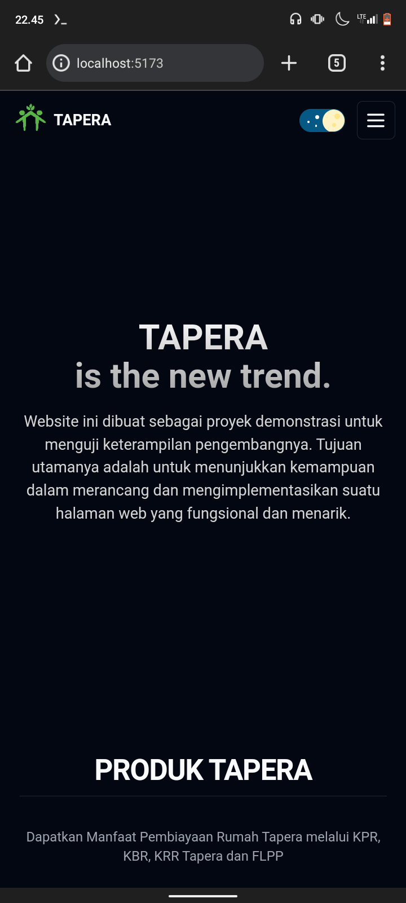
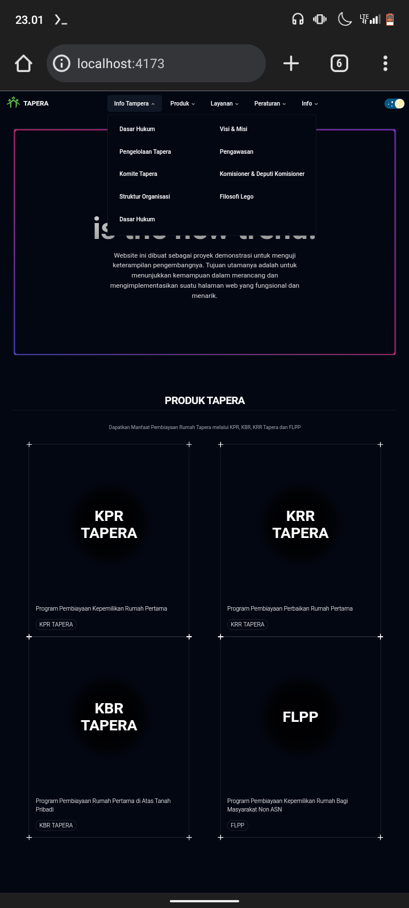
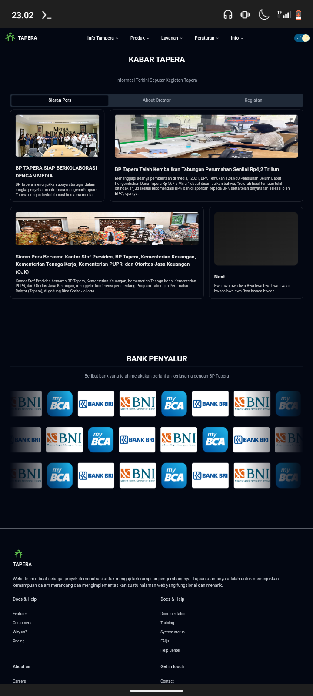
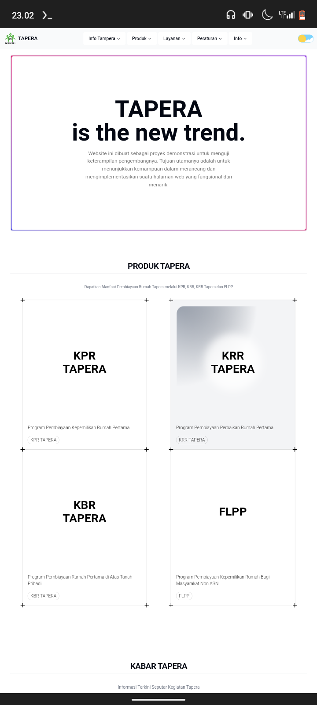

# Rebuild-website-tapera
# Tapera Website

Ini adalah proyek pembuatan website Tapera untuk keperluan belajar. Proyek ini mencakup berbagai teknologi dan konsep web development seperti Tailwindcss dan framework frontend seperti React.

## Fitur Utama

- **Beranda**: Halaman utama yang menampilkan informasi umum tentang Tapera.
- **Tentang Kami**: Halaman yang menjelaskan tentang latar belakang dan visi misi Tapera.
- **Kontak**: Formulir untuk menghubungi Tapera.
- **Blog**: Daftar artikel terkait dengan Tapera.

## Teknologi yang Digunakan

- Shadcn
- Tailwind css
- React

## Cara Menjalankan Proyek

1. Clone repositori ini ke lokal Anda:

   ```bash
   git clone https://github.com/username/tapera-website.git

   ```

2. Installation dependency

   ```bash
   yarn

   ```

3. run application
   ```bash
   yarn dev
   ```

## Demo Website






